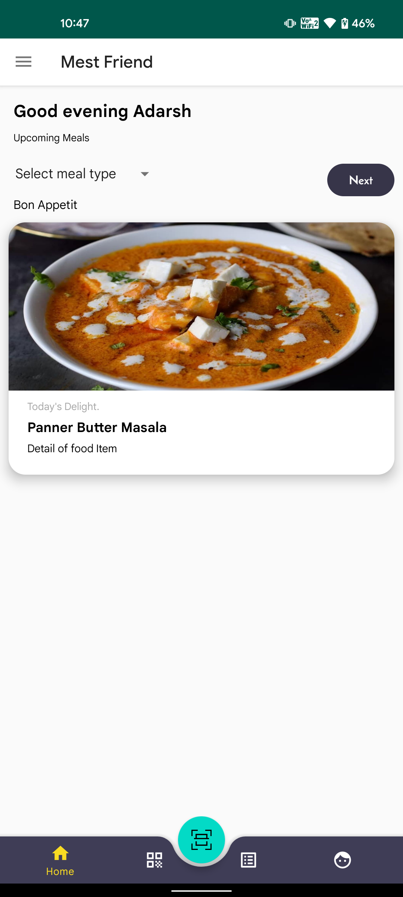
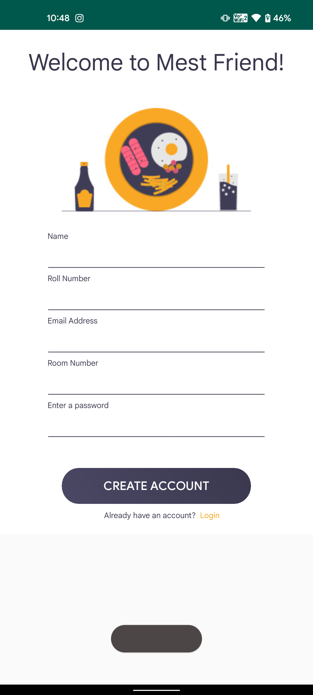
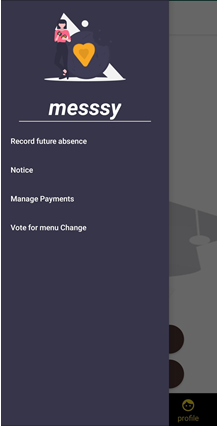
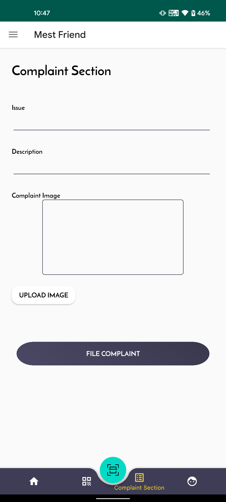

<h1 align="center">Mest Friend</h1>

An android mess management app that automates the various tasks that are carried out by mess attendees! 🎉 
Register For Your OWn Account Today 
Features of Mest Friend- 
🌟 Record future absence - Avoid's Wastage of Food and Saves Student's Money  
🌟 Notice Board - Notices can be posted regarding mess timing, changes in the menu, etc. 
🌟 Payment Management - All Details related to payements due or processesed can be seen here. 
🌟 Vote for menu change - Vote to add or remove certain items from the menu 
🌟 Complaint section - Complaints can be registed by the students, with the option to upload pictures (if any). 
🌟 e-Coupon - QR code scanner and generator in the form of e-Coupons to manage attendance and payment. 

<h2> Screenshots</h2> 

  
   
  
   
  

